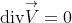
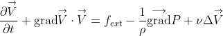
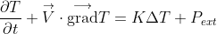

# HEAT EQUATION SOLVER FOR UNSTEADY INCOMPRESSIBLE FLOWS

This project is a solver for the Navier-Stokes model in the case of incompressible flows.





## Requirements
To compile the library :
- CMake  
- A C++ compiler  
- The PyBind11 library  

To use it with Python :
- Python 3+  
- The Numpy and Matplotlib libraries  

## How to install
Go to the code directory and execute the following commands to create a build directory to compile the library, a data directory to store the raw simulation outputs, and a results directory to save the postprocessed results.
```console
user@linux:~/path/to/code$ mkdir build  
user@linux:~/path/to/code$ mkdir data  
user@linux:~/path/to/code$ mkdir results  
```

Execute the following commands to compile the C++ library.
```console
user@linux:~/path/to/code$ cd build  
user@linux:~/path/to/code/build$ cmake ../src -DCMAKE_INSTALL_PREFIX=$PWD/install    
user@linux:~/path/to/code/build$ make install    
```

## How to use
Execute these commands to get to the python directory and add the library to the PYTHONPATH.
```console
user@linux:~/path/to/code$ cd python
user@linux:~/path/to/code/python$ export PYTHONPATH=$PWD/../build/install/lib/python
```

For each simulation, follow these steps :
- edit the parameters.py file
- execute the simulation.py file
- execute the plot.py file
